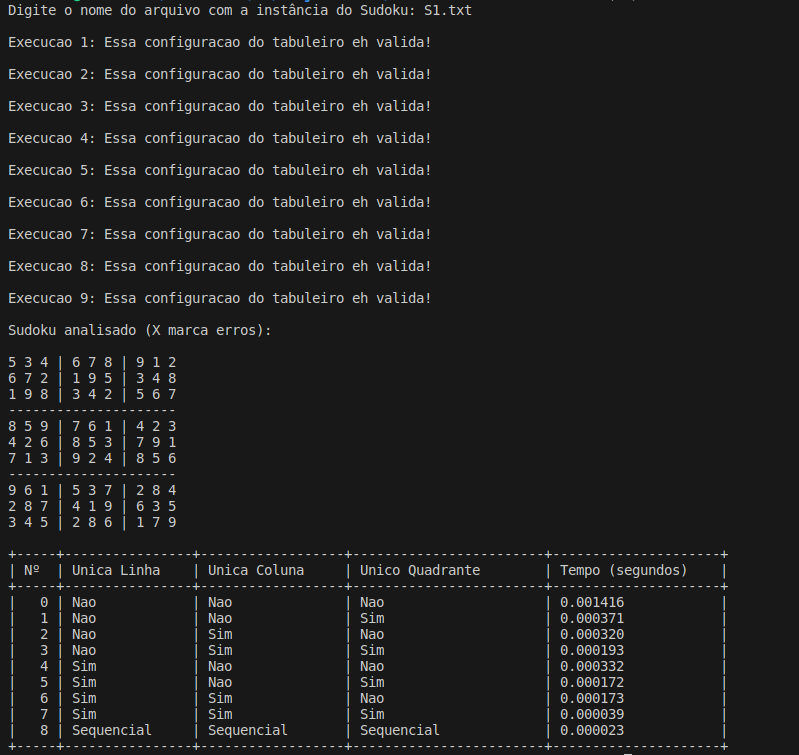

# Validador de Sudoku com PThreads

## 🧩 O que é o projeto?

Este projeto implementa um **validador de tabuleiro de Sudoku resolvido**, utilizando **threads com PThreads** em C para verificar:

- Linhas
- Colunas
- Quadrantes (3x3)

Cada aspecto pode ser validado com:
- **Uma única thread**, ou
- **Nove threads** (uma por linha, coluna ou quadrante)

Além disso, o projeto também realiza uma **validação sequencial completa** (sem uso de threads), apontando as **coordenadas com erros** no tabuleiro, caso existam.

Ao final da execução, é exibida uma **tabela no terminal** indicando:
- Uma tabela com o tempo de execução para cada combinação de threads
- A quantidade de threads utilizadas em cada cenário

---

## 🛠️ Estrutura do projeto

O projeto é feito em **C puro** com **bibliotecas padrão**, e está estruturado em múltiplos arquivos:

- `main.c`: Função principal
- `sudoku-validation.c`: Funções com validações por thread e uma função de validação sequencial
- `read-sudoku.c`: Função auxiliar de leitura para instanciação do tabuleiro 
- `sudoku-validation.h`: Declarações globais, macros e structs
- `Solutions/`: Pasta com 6 arquivos `.txt` contendo tabuleiros dados como entrada pelo usuário na execução

### ✅ Pré-requisitos
- Compilador GCC (ou G++) com suporte a pthread (ex: Linux ou WSL)

## 📆 Como compilar e executar

No terminal, estando dentro da pasta do projeto, execute:

```bash
gcc main.c -o sudoku -lpthread
```

> ⚠️ Atenção: O uso da flag `-lpthread` é recomendado para compilar com suporte a threads.

### Execute o projeto:

```bash
./sudoku
```

Durante a execução, o programa solicitará que você informe o nome de um dos arquivos contendo o tabuleiro de Sudoku. Esses arquivos estão localizados na pasta `Solutions/`, então, caso queira adicionar um novo arquivo, coloque-o na pasta.

> ✅ Exemplo de entrada válida:  
> `S3.txt`  
> ❌ Não use o caminho completo como `Solutions/S3.txt`.

---

## 🧠 Sobre a execução sequencial

Ao final de todas as execuções multithreaded, o programa realiza uma **execução sequencial completa**, sem uso de threads. Essa etapa serve como verificação final e retorna **quais posições do tabuleiro estão incorretas**, caso o tabuleiro não seja válido.

---

## 📈 Tabela de Tempo

Ao final da execução, o programa imprime uma tabela formatada com os tempos de execução (em segundos) para as seguintes combinações de quantidades de threads:


Linhas  | Colunas  | Quadrantes
--------|----------|------------
   1    |    1     |     1    
   1    |    1     |     9    
   1    |    9     |     1    
   1    |    9     |     9    
   9    |    1     |     1    
   9    |    1     |     9    
   9    |    9     |     1    
   9    |    9     |     9    

Exemplo de saída no terminal:

```
+-----+---------------------+------------------+------------------------+---------------------+
| Nº  | Unica Linha         | Unica Coluna     | Unico Quadrante        | Tempo (segundos)    |
+-----+---------------------+------------------+------------------------+---------------------+
|  0  | Nao                 | Nao              | Nao                    |       0.000123      |
|  1  | Nao                 | Nao              | Sim                    |       0.000153      |
...
|  8  | Execução Sequencial | Sequencial       | Sequencial             |       0.000097      |
+-----+---------------------+------------------+------------------------+---------------------+
```

---

## 🖼️ Interface do Programa

Abaixo está uma captura de tela da interface no terminal:



---

## ❗ Observação para usuários Windows

Este projeto depende de `pthreads`, que não está disponível nativamente no Windows. Para usuários Windows, recomenda-se:

- Uso de **WSL (Windows Subsystem for Linux)**
- Execução em uma máquina virtual Linux
- Acesso remoto a uma máquina Linux

---

## 📌 Distribuição de Tarefas

- **Enilson**:  
  Criação do repositório com uma primeira versão que continha um arquivo único com o funcionamento apenas para 9 threads de cada aspecto a ser avaliado.

- **Bertrand (e Ana)**:  
  Modularização do código juntamente com a lógica e estrutura necessários para executar todas as possibilidades de alocação de threads.

- **Ana (e Bertrand)**:  
  Construção e refinamento da lógica utilizada pelas threads para realizar a execução corretamente.

- **Ana, Bertrand e Enilson (simultaneamente)**:  
  Refinamento final e correção de bugs.

> 💡 **Observação**:  
> Durante quase toda a execução do projeto, foi utilizada a extensão do Visual Studio Code chamada **LiveShare** para aplicação da estratégia de *Pair Programming*.  
> Tendo isso em vista, todos os membros participaram em algum nível de todas as etapas do projeto, sendo os nomes destacados acima apenas os responsáveis majoritários por cada etapa.  
> Também vale ser mencionado que **Ana** não contribuiu diretamente ao repositório, pois enfrentou incompatibilidade com a biblioteca `pthreads` em seu sistema operacional (Windows), sem possibilidade viável de realizar dual boot em tempo hábil. Sua contribuição foi feita por meio de **acesso remoto ao computador de Bertrand**.

